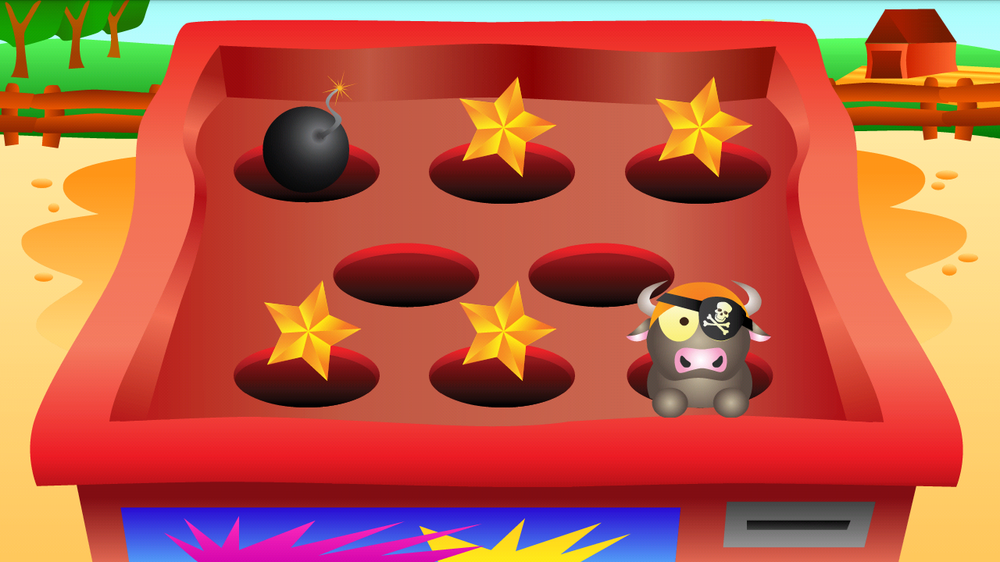

# Whistler Attack
Vivid game purposed for Android users. Inspired by popular whac-a-mole arcade game.

The code was written in 2013 and published in order to provide insights into source code details. 

Copyrights reserved, all the graphics and code belong to the author.

The project is no longer maintained.

